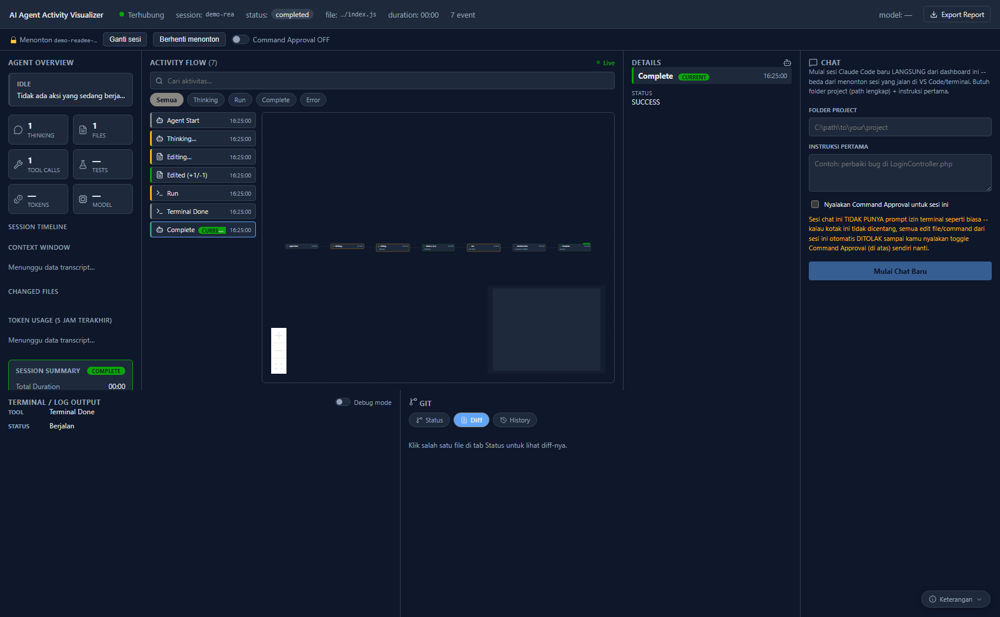
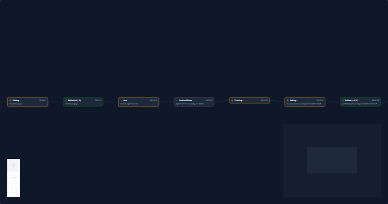

# AI Agent Activity Visualizer

**Watch what your AI coding agent is actually doing, in real time — not just
a wall of text scrolling by in a terminal.**

Every time [Claude Code](https://docs.claude.com/en/docs/claude-code) reads a
file, edits code, runs a command, or thinks, that event flows straight into a
visual timeline: a chronological list + connected graph nodes, real diffs,
terminal output, and a live preview of the file being worked on — all
updating on their own, no refresh needed.

📖 **Just want to use it?** See the [Usage Guide](docs/usage-guide.md) — step
by step, no technical background required.





## Chat directly from the dashboard (new)

Beyond watching a session running elsewhere, the dashboard can also **start
and drive a Claude Code session itself** — a real chat panel where you type
a project folder + a prompt, and Claude Code runs right there, streaming its
replies back live. This uses the official
[`@anthropic-ai/claude-agent-sdk`](https://www.npmjs.com/package/@anthropic-ai/claude-agent-sdk)
under the hood, on the Agent Server side — confirmed empirically (not
assumed) to use the exact same Claude Pro/Max login as normal Claude Code,
no separate API key or billing path, and its transcripts land in the same
`~/.claude/projects/` location this whole project already reads for token
usage. Every panel described above (Activity Flow, Token Usage, Command
Approval, …) works for these sessions automatically, no extra wiring needed.

**This only works for sessions the dashboard itself starts** — it can't send
new prompts into a session already running in your VS Code/terminal (that
process is owned by VS Code, not by the Agent Server); watching those stays
fully read-only as described above.

Tool calls (Edit/Write/Bash) in a dashboard-started chat have **no fallback
terminal prompt** — check "Nyalakan Command Approval untuk sesi ini" when
starting the chat, or nothing will ever get past a permission check.

## Why this exists

Claude Code (and other coding agents) already run their own closed internal
loop — we can't and don't need to change that. What *can* be observed are
its lifecycle points: session start, thinking, reading a file, editing a
file, running a command, finishing up. This project taps into those points
via [Claude Code's official hooks](https://docs.claude.com/en/docs/claude-code/hooks)
and turns them into a visualization that's actually pleasant to watch — so
you can follow the agent's process like looking over someone's shoulder
while they code, instead of guessing from text flying by in a terminal.

## What you get

- **Activity Flow** — a chronological list + node graph (auto-layout via
  dagre, with a mini-map) of every agent action: start, thinking, file reads,
  file edits (with a `+lines/-lines` summary), command runs, through to
  completion. Searchable, and filterable by Thinking/Run/Complete/Error.
- **Details panel** — click any action to see the real diff (`+`/`-` per
  line) or terminal output, a command category badge (Git/npm/Docker/…), an
  optional **Agent Thoughts** note (Claude's own text right before that
  action, straight from the local transcript — no extra LLM call), and an
  "Open in VS Code" link that jumps straight to the changed line.
- **Git panel** — read-only, independent of the Activity Flow timeline:
  **Status** (staged/modified/untracked files), **Diff** (click a file for a
  colored unified diff), **History** (last ~20 commits). Polls every ~5s.
  Runs only `git status`/`git diff`/`git log` on the server — never a command
  that changes repo state (no commit/push/pull/checkout/reset, ever).
- **Terminal / Log Output** — a concise summary (tool, file/command, status)
  by default; flip **Debug mode** on for the raw JSON of the selected event
  when you need to see exactly what a hook sent.
- **Session Summary & Export Report** — once a session finishes, a summary
  card recaps duration/tool calls/files changed/outcome; "Export Report"
  downloads the whole session (timeline, diffs stats, token usage) as a
  markdown file — built entirely from data already in the dashboard, no
  extra LLM call.
- **Command Approval** — an opt-in 3-way mode selector, per session: **Off**
  (dashboard doesn't get involved, Claude Code runs normally), **Manual**
  (actually **Allow/Deny** every pending Edit/Write/Bash call from the
  dashboard before it runs), or **Auto** (never pauses — everything runs
  immediately, but each auto-approved action still shows up in Activity Flow
  tagged **AUTO** so there's still a visible trail). Off by default for every
  session; switching it only affects the one session you're watching. Manual
  fails open by design: no answer within 20s (or the session is Off), and it
  falls back to Claude Code's own native permission prompt — the dashboard is
  an optional shortcut, never a single point of failure. A separate read-only
  banner still mirrors other Claude Code notifications (e.g. idle reminders)
  with no buttons at all.
- **Agent Overview** — current status, tool-call/file/edit counts, and
  token usage for the last 5 hours (real numbers from Claude Code's local
  transcript — not an estimate, and never framed as "quota remaining," since
  true account-wide limit data simply isn't accessible from outside).
- **Session picker** — the dashboard **never guesses** which session to
  show. You type in a `session_id` explicitly, and only then does it start
  displaying anything. Safe to use even with several Claude Code sessions
  running at once.
- **VS Code Extension** (optional) — a status bar item + line highlighting
  for the file being edited + a lightweight activity panel in the sidebar,
  no dashboard tab required.
- **Legend** — a small collapsible "Keterangan" button in the corner spells
  out what each status color (yellow=running, green=done, red=error,
  gray=idle) and icon means, for anyone opening the dashboard for the first
  time without a walkthrough.

## What this project deliberately does **not** do

- **Never calls an extra LLM.** Every event comes from data that already
  exists (hook payloads, local transcripts) — no new API calls, no extra
  tokens or cost just to power this visualization.
- **Never sends event history back to Claude Code as a prompt.** This is
  purely one-way observation; it never interferes with the conversation or
  the agent loop.
- **Never touches or modifies the Claude Code extension itself** — the VS
  Code extension here is just a separate WebSocket consumer, same as the
  dashboard.

## Architecture at a glance

```
Claude Code hooks  →  hooks/emit-event.js  →  Agent Server (Express + ws)
                                                     │
                                     ┌───────────────┼───────────────┐
                                     ▼                                ▼
                              Dashboard (React)          VS Code Extension
                              WebSocket + REST backfill    WebSocket + REST
```

The Agent Server is the **single source of truth for state** (in-memory, per
`session_id`) — the dashboard and extension are pure consumers, free to
reconnect/refresh at any time without losing history.

## Folder structure

```
server/              Agent Server — event bus + WebSocket + REST (Express)
hooks/                emit-event.js — invoked by Claude Code via hooks
mock-agent/           Agent simulator, no Claude Code required
dashboard/            React dashboard (Vite + Zustand + React Flow)
vscode-extension/     VS Code extension (status bar, highlighting, sidebar)
```

## Quick start

Requires **Node.js 20+**.

### 1. Try it without Claude Code first (mock agent)

```bash
# Terminal 1 — Agent Server
npm install
npm run server          # runs on http://localhost:4000

# Terminal 2 — Dashboard
npm run dashboard        # runs on http://localhost:5173

# Terminal 3 — simulate one agent session
npm run mock-agent
```

Open `http://localhost:5173`, paste in the `session_id` printed by the
mock-agent terminal, click **Watch** (the dashboard defaults to Indonesian
— that button reads "Tonton" until you switch to English via the language
switcher in the status bar) — the timeline fills in immediately.

### 2. Connect a real Claude Code session

1. **Easiest way**: open the dashboard while no session is being watched —
   it shows a status card **"Claude Code hooks: X/Y installed"** with an
   **Install Hooks** button that writes the config for you (backs up your
   existing `~/.claude/settings.json` first). Manual alternative, for full
   control: register `hooks/emit-event.js` and `hooks/request-permission.js`
   in `~/.claude/settings.json` yourself (see the example config in
   [`hooks/settings.example.json`](hooks/settings.example.json) — wire them
   up to the `SessionStart`, `UserPromptSubmit`, `PreToolUse`,
   `PostToolUse`, and `Stop` hooks, on the `Edit|Write`, `Read`, `Bash`, and
   `PowerShell` matchers). Either way, install it at the **user** (global)
   level so it applies to every project, not just one.
2. Make sure the Agent Server is running (`npm run server`).
3. Start or continue a Claude Code session as usual, in any project.
4. Copy that session's `session_id` (visible near the start of the
   transcript / Claude Code's status), paste it into the dashboard, click
   **Watch**.

Troubleshooting details (including the case of a session that was already
running before hooks were installed) are in
[`hooks/README.md`](hooks/README.md).

### 3. VS Code Extension (optional)

See [`vscode-extension/README.md`](vscode-extension/README.md) for how to
run it via F5 (Extension Development Host).

## Stack

- **Agent Server** — Node.js, Express, `ws`, an in-memory `SessionStore`.
- **Dashboard** — React 19, Vite, Zustand, [`@xyflow/react`](https://reactflow.dev/)
  (React Flow) + `dagre` for graph auto-layout, `lucide-react` for icons.
- **VS Code Extension** — plain VS Code Extension API, no dependency on the
  Claude Code extension itself.

## Project status

Built incrementally and validated end-to-end against real Claude Code
sessions (not just mock data) — see the validation notes in
[`hooks/README.md`](hooks/README.md). Solid for day-to-day use watching your
own Claude Code sessions; contributions and issues welcome.
